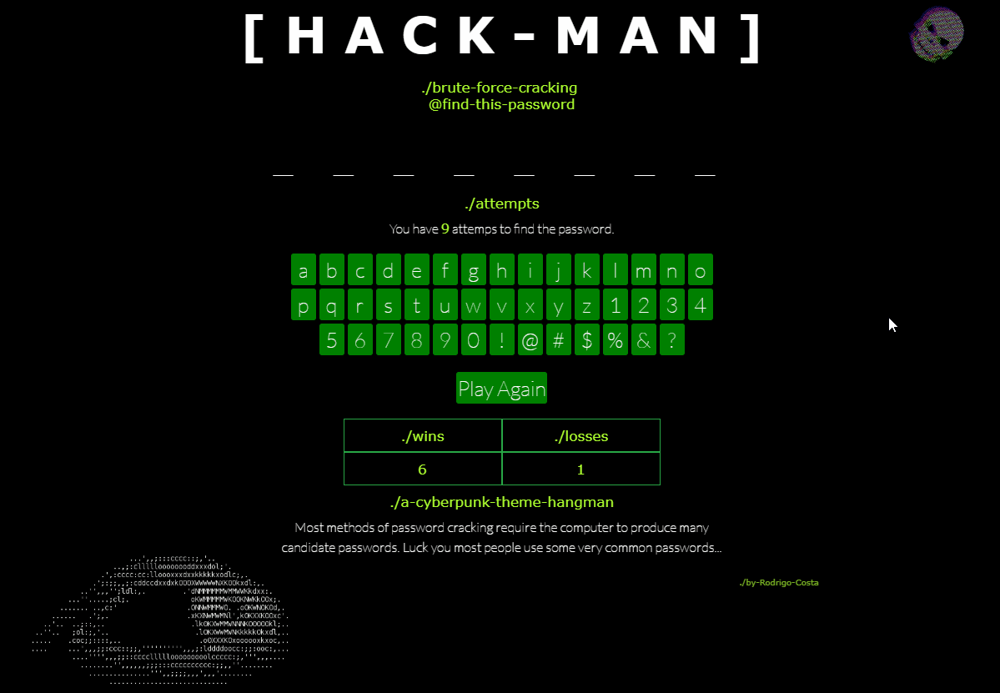

# hackman-hang

A cyberpunk theme hangman game.

https://costargc.github.io/hackman-hang/

## ./a-cyberpunk-theme-hangman

Most methods of password cracking require the computer to produce many candidate passwords. Luck you most people use some very common passwords...

## TO DO

- [x] change console.log() to show an ascii-art instead of the password directly
- [x] add favicon.icon to html
- [x] show full password when lives end
- [ ] remove onclick from html and add it do DOM in js >> document.getElementById("ID").onclick = function () { clickme() };
- [ ] delete images not being used
- [ ] add to css instead of html >> class="col-2 border border-success "style="min-width: 100px;"
- [ ] sign page
- [ ] add a better way to tell people when they won/lose the game
- [ ] update page in codepen.io
- [ ] 'allowedchars' and 'allpass' array to be read from txt file
